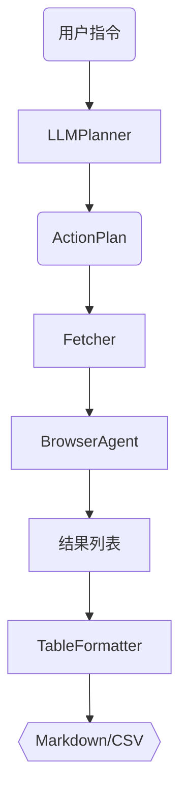

# LangGraph Smart WebRPA

> 用 LLM + 浏览器打造你专属的信息流助手

> **定位**：面向“信息流类站点”（B 站、Twitter/X、小红书 …）的个人化自动阅读工具。\
> **特色**：LLM 生成操作 → Playwright 真实浏览 → Markdown/CSV 表格推送。\
> **差异化**：聚焦时间线内容、强调高成功率与结果可读性，而非通用网页爬虫。

---

## 1. 为什么要做？

- 社交媒体信息爆炸，人工刷流浪费时间。
- 通用信息聚合工具推荐的是“大众热门”，不等于你感兴趣的。
- 我们想做的是：AI 能像你一样去刷常用站点，为你挑出真正相关内容。
- 这些站点 API 不开放或速率受限，用浏览器模拟最稳。
- 借助 LLM 自动生成步骤，用户不用写脚本。
- **我们不应被推荐算法裹挟，而是善用它来服务我们的成长目标。**
- 比如你想学习 AI，那就应尽可能收集 AI 领域的最新优质内容，而不仅仅被算法吸引去刷娱乐内容。

### 1.1 使用场景（我们为谁服务？）

- 没时间刷 B 站 / X / 小红书，但又不想错过重要内容。
- 希望有「只为我准备」的精选列表，而不是千篇一律的推荐。
- 希望每天早晚固定收到一份内容摘要，而无需手动打开网站。
- 想从 AI 那里获取筛选过的信息，而不是海量原始数据。
- 有明确的兴趣/学习目标，想聚焦这类内容进行长期追踪。

---

## 2. 技术栈一览

| 层级     | Python 路线（默认，最快落地）        | TypeScript 路线（可选）             |
| ------ | ------------------------- | ----------------------------- |
| 智能体框架  | **LangGraph** + LangChain | LangChainJS + 自研 DAG 或 xstate |
| 浏览器控制  | **Playwright Python**     | Playwright NodeJS             |
| 服务端    | FastAPI (Webhook)         | Next.js / Express             |
| 自动化平台  | n8n / Zapier Webhook      | 同左                            |
| UI（可选） | mkdocs-material / React   | Next.js / SvelteKit           |

> **推荐**：先用 Python 路线在 1 周内跑通 MVP，再按需补 TS 版本。

---

## 3. 版本里程碑

### 🚀 V0 — CLI 按需拉取（MVP）

| 目标                                        | 技术点                                        | 交付物                                                         |
| ----------------------------------------- | ------------------------------------------ | ----------------------------------------------------------- |
| `read bilibili` 获取热门/关注流 → 输出 Markdown 表格 | LLMPlanner → BrowserAgent → TableFormatter | `examples/bilibili_hot.py`、`outputs/2024-xx-xx/bilibili.md` |

### 🔄 V1 — 定时推送

| 目标                                                    | 技术点                            | 交付物                       |
| ----------------------------------------------------- | ------------------------------ | ------------------------- |
| 后台 cron 每日 8 AM / 8 PM 抓取 → Webhook 到 n8n → 邮件/Notion | `scheduler.py` + WebhookSender | `outputs/` 自动更新，n8n 工作流模板 |

### 🎯 V2 — 个性化排序

| 目标                      | 技术点           | 交付物                         |
| ----------------------- | ------------- | --------------------------- |
| 根据用户点击/停留学习作者亲近度 → 排序推送 | 简易打分模型 + 点击日志 | `profiles/user.json`、排序效果报告 |

### 📊 V3 — Web 仪表盘

| 目标                | 技术点                          | 交付物                |
| ----------------- | ---------------------------- | ------------------ |
| 在线查看 / 标记「有用」「无用」 | FastAPI + React (or Next.js) | `/dashboard` 可交互界面 |

> 📝 超出范围的功能（点赞去重、工作流回放）放入 Backlog，按需求再提。

---

## 4. MVP 模块（V0）

| 模块                      | 职责                                                     |
| ----------------------- | ------------------------------------------------------ |
| **LLMPlannerAgent**     | 将自然语言指令转 `ActionPlan` JSON                             |
| **BrowserAgent**        | Playwright 执行 `goto / click / scroll / wait / extract` |
| **FetcherAgent**        | 调用 BrowserAgent，返回条目列表                                 |
| **TableFormatterAgent** | 渲染 Markdown/CSV 表格                                     |

**成功判定**：

1. 运行 CLI 脚本后 `outputs/` 有表格；
2. 终端提示 `✅ 已抓取 N 条`。

---

## 5. 流程架构（V0）



> V1 将在 G → H 之间加 **WebhookSender**；V2 增加 **Ranker** 节点。

---

## 6. 项目目录（建议）

```
.
├─ agents/
│   ├─ llm_planner.py
│   ├─ browser_agent.py
│   ├─ fetcher_agent.py
│   ├─ formatter_agent.py
│   └─ scheduler.py          # V1
├─ prompts/
├─ outputs/
├─ examples/
│   ├─ bilibili_hot.py
│   ├─ twitter_timeline.py
│   └─ xhs_hot.py
├─ requirements.txt
└─ README.md
```

---

## 7. 快速开始（Python）

```bash
# 克隆 & 进入
$ git clone https://github.com/yourname/langgraph-smart-webrpa.git
$ cd langgraph-smart-webrpa

# 虚拟环境 & 依赖
$ python -m venv .venv && source .venv/bin/activate
$ pip install -r requirements.txt
$ playwright install

# 设置 LLM KEY
$ export OPENAI_API_KEY=<your-key>

# 运行 B 站示例
$ python examples/bilibili_hot.py
```

---

## 8. 后续 Backlog

- 点赞/播放量排序、去重
- Selector 自愈算法
- Workflow 回放 / 社区库
- 多用户偏好建模（作者偏好 / 内容类别）
- 私人兴趣配置面板（可视化）
- 支持周报/月报自动整理

---

## 9. 贡献 & 许可证

（略）

